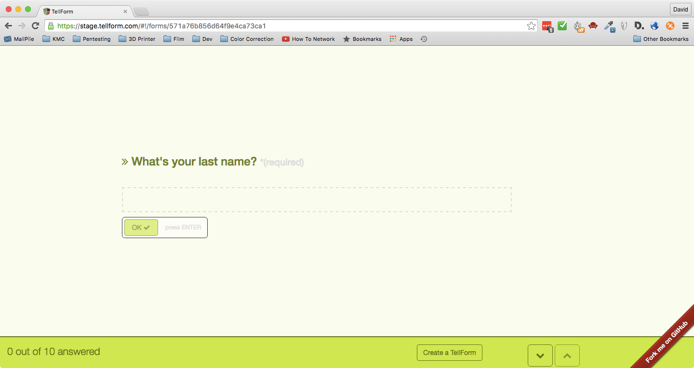
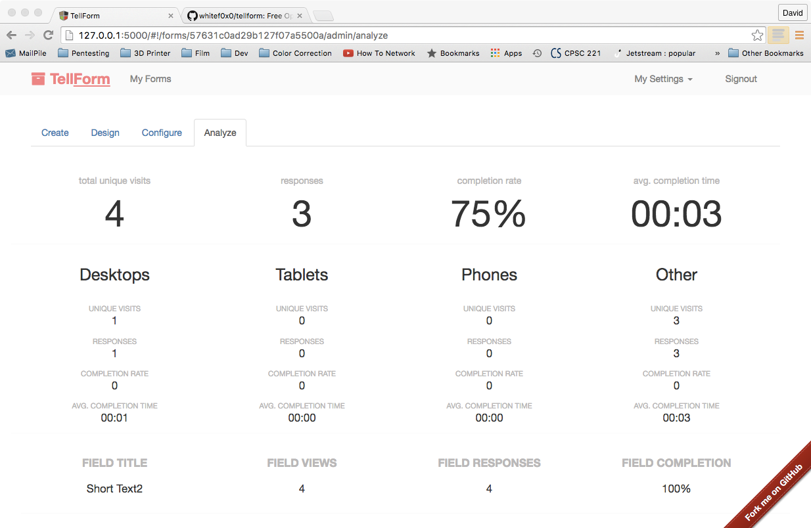

TellForm
========

Current stable release: v1.3.0 

[](https://www.paypal.com/cgi-bin/webscr?cmd=_s-xclick&hosted_button_id=UY555MCBZM722)
[](http://waffle.io/whitef0x0/tellform)
[](https://travis-ci.org/whitef0x0/tellform)

[](https://codeclimate.com/github/whitef0x0/tellform)
[](https://www.codacy.com/app/david-baldwin/tellform?utm_source=github.com&amp;utm_medium=referral&amp;utm_content=whitef0x0/tellform&amp;utm_campaign=Badge_Grade)
[](https://gitter.im/whitef0x0/tellform?utm_source=badge&utm_medium=badge&utm_campaign=pr-badge)

TellForm is an *opensource alternative to TypeForm* built ontop of nodejs that can create stunning forms from PDFs or from scratch

[See examples here](https://tellform.com/examples) 

##Screenshots



## Features	

###Currently following features are implemented:
	-Multi-Language Support
	-11 possible types of form fields
	-Editable startpage
	-Export Submissions to XLS, JSON or CSV
	-Native Analytics and Google Analytics Support
	-Custom subdomains
	-Embeddable Forms

###TODO:
	-Implement encryption for all form data
	-Integrate AWS for PDF saving
	-Add Typeform API integration
	-Add plugin/3rd party integration support (ala Slack)
	-Create wiki for easy installation and setup


## Quickstart

Before you start, make sure you have Redis installed and running at 127.0.0.1:6379

Install dependencies first.
```bash
$ npm install
$ bower install
```

Setup environment.
```bash
$ grunt build
```

Create your user account
```bash
$ node ./scripts/setup.js
```

OR create your .env file
```
GOOGLE_ANALYTICS_ID=yourGAID
PRERENDER_TOKEN=yourPrerender.ioToken
COVERALLS_REPO_TOKEN=yourCoveralls.ioToken
MAILER_EMAIL_ID=SMTP_Injection
MAILER_FROM=noreply@yourdomain.com
MAILER_PASSWORD=your_sparkpost_apikey
MAILER_SERVICE_PROVIDER=SparkPost
BASE_URL=yourdomain.com
DSN_KEY=yourPrivateRavenKey
```

Side note: ___Currently we are using Raven and Sentry [https://www.getsentry.com](https://www.getsentry.com) for error logging. To use it you must provide a valid private DSN key in your .env file and a public DSN key in app/views/layout.index.html___

Create this directory or you will get errors.

```
mkdir uploads/pdfs
```

Edit the 'env' config in gruntfile.js to make sure your .env file is being used. If you don't include this your app won't run

To run development version:

Set ```NODE_ENV=development``` in .env file
```$ grunt````

To run production version:

Set ```NODE_ENV=development``` in .env file
```$ grunt````

Your application should run on port 3000 or the port you specified in your .env file, so in your browser just go to [http://localhost:3000](http://localhost:3000)


## Testing Your Application
You can run the full test suite included with MEAN.JS with the test task:

```
$ grunt test
```

This will run both the server-side tests (located in the app/tests/ directory) and the client-side tests (located in the public/modules/*/tests/).

To execute only the server tests, run the test:server task:

```
$ grunt test:server
```

And to run only the client tests, run the test:client task:

```
$ grunt test:client
```

Currently the live example uses heroku github deployments. The Docker file is out of date and does not work. If someone wishes to get it working feel free to submit a pull request.

To calculate your total test coverage with Istanbul, run the coverage task
```bash
$ grunt coverage
```

To calculate your server-side test coverage with Istanbul, run the coverage task
```bash
$ grunt coverage:server
```

To calculate your client-side test coverage with Istanbul, run the coverage task
```bash
$ grunt coverage:client
```

## Sponsors
[](https://digitalocean.com/)
[](https://getsentry.com/)
[](https://statuspage.io/)

## Where to get help

[Gitter Chat](https://gitter.im/whitef0x0/tellform)

[Official Twitter](https://twitter.com/tellform_real)

## Contributor list 

[David Baldwynn](https://github.com/whitef0x0/)

[Samuel Laulhau](https://github.com/lalop)

[Arun Pattnaik](https://github.com/arunpattnaik)

## Mentions on the Web

[Mister Ad](http://start.mister-ad.biz/newsticker/open-source-alternative-zu-typeform-tellform-in-der-kurzvorstellung/)

[t3n.de](http://t3n.de/news/open-source-alternative-typeform-tellform-707295/)

[BootCSS Expo](http://expo.bootcss.com/)

[Product Hunt](https://www.producthunt.com/tech/tellform)

[Hacker News Post](https://news.ycombinator.com/item?id=11711095)

[Reddit Posts](https://www.reddit.com/domain/tellform.com/)

[Betapage](https://betapage.co/startup/tellform)

## Credits
Inspired/built off the great work of the [MeanJS team](https://github.com/mean/) and [Typeform](http://typeform.com)
